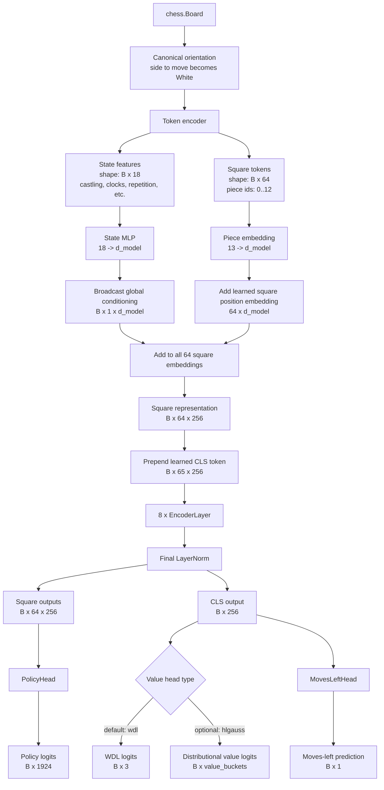
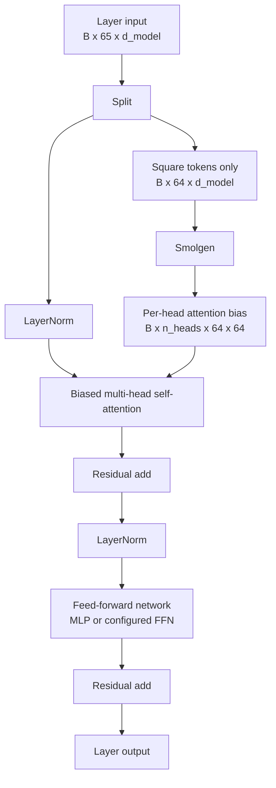
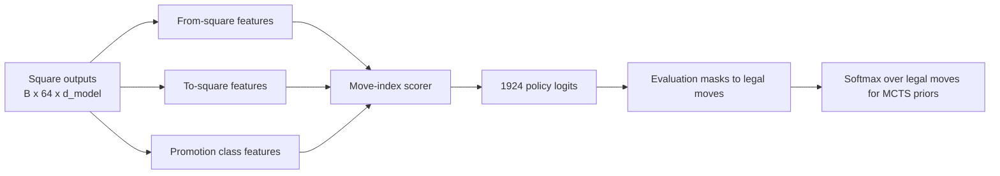

# Current Model Architecture Diagram

This diagram describes the current `ChessTransformer` path implemented in `src/model/transformer.py`, with heads from `src/model/heads.py` and default dimensions from `config.py`.

## High-Level Flow



## Encoder Layer Detail

Each transformer block uses side-to-move canonical square embeddings and a Smolgen-style learned attention bias.



Note: Smolgen is generated from the 64 square tokens. The model sequence also contains a CLS token, so implementations must be careful about how the 64 x 64 bias is applied relative to the 65-token attention sequence.

## Policy Head Shape

The policy head maps square representations to the fixed move-index vocabulary used by `MoveEncoder`.



The current interface emits all 1924 logits. During evaluation, illegal moves are filtered by the legal move list before normalization.

## Search Integration

```mermaid
flowchart TD
    A[Current board] --> B[TransformerEvaluator]
    B --> C[Encode board batch]
    C --> D[ChessTransformer]

    D --> E[Policy logits]
    D --> F[WDL or distributional value]

    E --> G[Legal move mask + softmax]
    G --> H[MCTS priors P(s,a)]

    F --> I[Expected value]
    I --> J[MCTS leaf value]

    H --> K[Batched PUCT MCTS]
    J --> K
    K --> L[Move selection]
```

## Default Architecture Constants

```text
d_model:             256
n_layers:            8
n_heads:             8
d_ff:                1024
state_dim:           18
policy_size:         1924
value_head_type:     wdl
value_buckets:       64 when using hlgauss
smolgen_compress:    32
smolgen_hidden:      128
smolgen_gen:         128
transformer_dropout: 0.0
baseline params:     about 10.3M
```

## Architectural Interpretation

The current model is best understood as:

```text
canonical board tokenizer
-> square-token transformer with learned relational attention bias
-> flat move-policy head
-> global value head from CLS
-> moves-left auxiliary head
-> MCTS evaluator that masks illegal moves and consumes policy/value outputs
```

It is a strong prototype architecture for policy/value distillation, but it is still missing richer history representation, explicit legal-move feature scoring, and search-trained policy/value targets for a Stockfish-beating trajectory.
